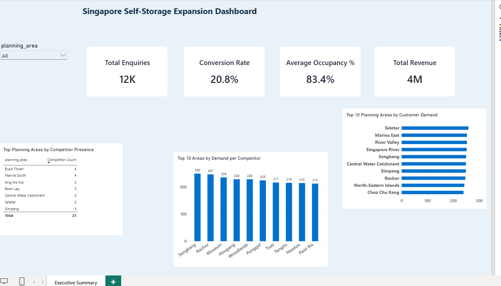

# Singapore Self-Storage Expansion Analytics

## Commercial Analytics | Site Selection | Market Opportunity | Power BI

A Singapore-focused commercial analytics project designed to evaluate
self-storage market performance, customer demand, competitor presence,
location attractiveness, and potential expansion opportunities.

The project combines SQL, Python, Power BI, financial analysis, and
location-based market analysis to support data-driven expansion decisions.

---

### Dashboard Preview

### Power BI File

The complete Power BI report is available here:

[Download Power BI Dashboard](powerbi/singapore_self_storage_expansion.pbix)

## Business Objective

The objective is to identify underserved Singapore planning areas and
evaluate potential locations for future self-storage expansion.

The analysis considers:

- Customer enquiries
- Lead conversion
- Store occupancy
- Revenue
- Revenue per square foot
- Competitor presence
- Population density
- Business density
- Traffic flow
- Household characteristics
- Rental costs
- Fit-out costs
- Investment requirements
- Projected EBITDA
- Payback period

The final objective is to answer:

> Where should a self-storage operator consider opening its next facility
> in Singapore?

---

# Business Questions

### Customer Demand

1. Which Singapore planning areas generate the highest customer demand?
2. Which areas have high enquiries but limited competitor presence?
3. Which customer segments generate the highest demand?
4. What is the enquiry-to-customer conversion rate?
5. Which locations have improving or declining demand?

### Store Performance

6. Which stores have the highest occupancy?
7. Which stores generate the highest revenue?
8. Which stores have the strongest revenue per square foot?
9. Is higher occupancy associated with higher revenue?
10. Which stores are underperforming relative to their capacity?

### Competition

11. Which planning areas have the highest competitor concentration?
12. How does competitor density vary across Singapore?
13. How does pricing compare across competitors?
14. Which markets appear underserved?

### Expansion

15. Which planning areas represent the strongest expansion opportunities?
16. Which candidate sites have the best demand-to-competition ratio?
17. How does rental cost affect investment attractiveness?
18. What is the estimated payback period for each candidate site?
19. Which sites should management prioritize?

---

# Project Approach

The project follows a commercial analytics workflow:

Customer Demand
        ↓
Store Performance
        ↓
Competitor Analysis
        ↓
Market Gap Analysis
        ↓
Candidate Site Evaluation
        ↓
Financial Modelling
        ↓
Expansion Recommendation

---

# Data Sources

This project uses synthetic data created for portfolio and analytical
demonstration purposes.

The data structure is designed to represent the types of datasets that
could be used in a real self-storage commercial analytics environment.

### Main datasets

| Dataset | Description |
|---|---|
| stores.csv | Existing store information |
| planning_area.csv | Singapore planning-area attributes |
| customer_enquiries.csv | Customer enquiry and conversion data |
| monthly_store_performance.csv | Monthly store KPIs |
| competitor_facilities.csv | Competitor location and pricing data |
| candidate_sites.csv | Potential future expansion sites |

---

# Technology Stack

### SQL
- Data validation
- Aggregation
- KPI calculation
- Customer analysis
- Competitor analysis
- Market opportunity analysis

### Power BI
- Executive dashboards
- KPI cards
- Market opportunity analysis
- Location analysis
- Store performance
- Expansion pipeline

### Python
- Data cleaning
- Exploratory analysis
- Data preparation
- Supporting analysis

### Excel / Financial Modelling
- Investment assumptions
- Scenario analysis
- Sensitivity analysis
- Payback analysis

---

# Power BI Dashboard

## Executive Summary

The Executive Summary provides management with a high-level view of:

- Total enquiries
- Conversion rate
- Average occupancy
- Total revenue
- Customer demand
- Competitor presence
- Demand per competitor

---

# Planned Dashboard Pages

## 1. Executive Summary

Provides an overview of commercial performance and market demand.

Key KPIs:

- Total Enquiries
- Conversion Rate
- Average Occupancy
- Total Revenue

Key visuals:

- Customer demand by planning area
- Competitor presence
- Demand per competitor

---

## 2. Market Opportunity

Identifies potential underserved markets across Singapore.

Analysis includes:

- Population density
- Customer enquiries
- Competitor count
- Business density
- Traffic flow
- Market opportunity score

Key question:

> Which planning areas have strong demand but relatively low competition?

---

## 3. Store Performance

Evaluates the performance of existing facilities.

Metrics include:

- Occupancy
- Revenue
- Revenue per square foot
- EBITDA
- Enquiries
- Conversion rate

---

## 4. Customer & Sales Analytics

Analyzes customer acquisition and conversion.

Metrics include:

- Enquiries
- Qualified leads
- Converted customers
- Conversion rate
- Customer segment
- Enquiry source
- Planning area

---

## 5. Competitor & Pricing Intelligence

Evaluates competitive market conditions.

Analysis includes:

- Competitor count
- Competitor pricing
- Price per square foot
- Promotional activity
- Competitor occupancy
- Market concentration

---

## 6. Expansion & Site Selection

Evaluates potential future sites.

Candidate sites are ranked using:

- Customer demand
- Population density
- Business density
- Traffic flow
- Competition gap
- Estimated revenue
- Rental cost
- Fit-out cost
- Initial investment
- EBITDA
- Payback period

---

# Market Opportunity Score

A weighted scoring framework is used to prioritize planning areas.

Example weighting:

| Factor | Weight |
|---|---:|
| Customer Demand | 30% |
| Population Density | 20% |
| Business Density | 15% |
| Competition Gap | 15% |
| Traffic Flow | 10% |
| Revenue Potential | 10% |

The final score is used to rank potential expansion markets.

---

# Financial Analysis

Candidate locations are evaluated using a simplified investment model.

### Revenue

Projected Revenue =
Projected Occupied Units × Average Monthly Rental × 12

### EBITDA

EBITDA =
Revenue - Operating Costs

### Initial Investment

Initial Investment =
Fit-Out Cost + Deposits + Other Setup Costs

### Payback Period

Payback Period =
Initial Investment / Annual EBITDA

---

# Sensitivity Analysis

The financial model allows key assumptions to be tested.

### Rental Sensitivity

- -10%
- -5%
- Base Case
- +5%
- +10%

### Occupancy Sensitivity

- 60%
- 70%
- 80%
- 90%

### Fit-Out Cost Sensitivity

- -10%
- Base Case
- +10%
- +20%

This helps management understand how changes in assumptions affect
investment returns.

---

# Key Analytical Insights

The analysis is designed to identify:

### High Demand + Low Competition

Potential underserved markets with strong expansion potential.

### High Demand + High Competition

Attractive markets requiring careful pricing and differentiation.

### Low Demand + Low Competition

Markets requiring further investigation before investment.

### Low Demand + High Competition

Potentially unattractive expansion markets.

---

# Example Management Recommendation

A potential expansion recommendation would consider multiple factors
rather than relying on a single KPI.

For example:

> Planning Area A demonstrates strong customer demand, relatively low
> competitor density, attractive population characteristics, and an
> acceptable projected payback period. The location should therefore be
> considered for further commercial and operational due diligence.

---

# Data Quality

Data validation checks include:

- Null value checks
- Duplicate checks
- Invalid planning areas
- Negative revenue checks
- Invalid occupancy values
- Missing competitor locations
- Outlier detection
- Referential integrity checks

---

# Skills Demonstrated

This project demonstrates practical experience in:

- SQL
- Power BI
- DAX
- Python
- Data Analysis
- Commercial Analytics
- Financial Modelling
- Scenario Analysis
- Sensitivity Analysis
- Market Research
- Competitor Analysis
- Location Analytics
- Site Selection
- Data Validation
- Dashboard Development
- Business Storytelling

---

# Disclaimer

This is a portfolio project using synthetic data.

The analysis is intended to demonstrate analytical methodology and
commercial decision-making capabilities and does not represent actual
financial or operational data from any company.

---

# Author

Data Analytics Portfolio Project

Singapore Self-Storage Expansion Analytics
